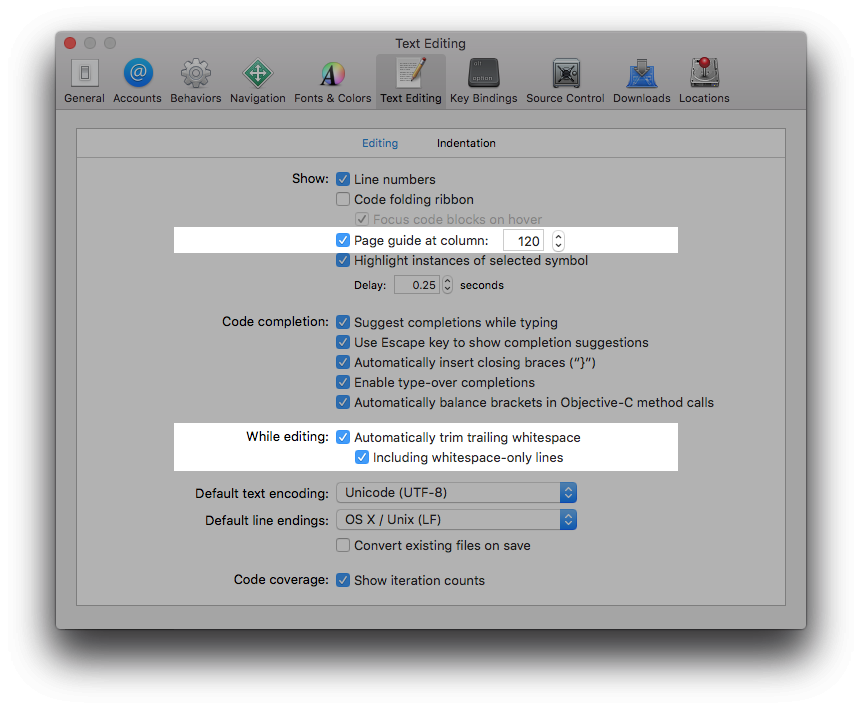
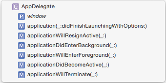

# The Swift Style Guide

This guide is based on the following sources:

- [The Swift Official Style Guide](https://swift.org/documentation/api-design-guidelines)
- [The Swift Programming Language](https://developer.apple.com/library/prerelease/ios/documentation/Swift/Conceptual/Swift_Programming_Language)
- [Github Swift style guide](https://github.com/github/swift-style-guide)
- [Ray Wenderlich Swift style guide](https://github.com/raywenderlich/swift-style-guide)
- [SlideShare Swift style guide](https://github.com/SlideShareInc/swift-style-guide)
- [Netguru Swift style guide](https://github.com/netguru/swift-style-guide)

### Purpose of the style guide

This guide is intended to outline the set of shared practices Fueled will apply to current and future Swift Projects in order to implement a uniform Swift code style, readability, consistency and simplicity.

This is an attempt to encourage patterns that accomplish the following goals (in
rough priority order):

 1. Increased rigor, and decreased likelihood of programmer error
 1. Increased clarity of intent
 1. Reduced verbosity
 1. Fewer debates about aesthetics

This guide has been written for Swift 3.

### Contribution

If you want to suggest a change or addition that will help accomplish
the [Purpose](#purpose-of-the-style-guide) of this style guide, please open a pull request that:

 1. Explains the guideline
 1. Demonstrates the guideline with more-or-less valid example code
 1. Justifies the guideline by explaining the rationale behind it

Just note that all suggestions are open to discussion and debate! :smile:

## Table of contents

* [Xcode Preferences](#xcode-preferences)
	* [Spacing](#spacing)
* [Swift Specific Guides](#swift-specific-guides)
	* [Naming](#naming)
		* [Functions and Arguments](#functions-and-arguments)
		* [Enumerations](#enumerations)
	* [Access Control](#access-control)
	* [Switch](#switch)
	* [Control Flow](#control-flow)
	* [Properties](#properties)
		* [Identifiers](#identifiers)
	* [Closures](#closures)
	* [Singleton](#singleton)
	* [Strings](#strings)
	* [Enums](#enums)
	* [Documentation](#documentation)
	* [Custom Types & Type Identifiers](#custom-types-&-type-identifiers)
	* [Mutability](#mutability)
	* [Optionals](#optionals)
	* [Static code vs Dynamic code](#static-code-vs-dynamic-code)
	* [Classes and Inheritance](#classes-and-inheritance)
	* [Operator definitions](#operator-definitions)
* [Code organization](#code-organization)
	* [File Code Organization](#file-code-organization)
	* [Project Code Organization](#project-code-organization)
* [Value Types vs Reference Types](#value-types-vs-reference-types)
* [Cocoa Specific Guides](#cocoa-specific-guides)
	* [Protocols](#protocols)
		* [UITableView & UICollectionView](#UITableView-&-UICollectionView)
	* [NSNotification](#NSNotification)
	* [View Controllers](#View-Controllers)
	* [UIView](#UIView)
	* [Core Foundation](#Core-Foundation)
	* [User Facing Strings](#User-Facing-Strings)
	* [Objective-C Interoperability](Objective-C-Interoperability)
* [Forbidden](#forbidden)

	
## Xcode Preferences

### Indentation

Code should be indented with tabs (as shown in the example below) rather than spaces so that the author may decide as a matter of preference how many spaces each tab is displayed as. This can be changed from the default in Xcode->Preferences->Text Editing->Indentation

It is also recommended that you disable line wrapping to further improve readability. While this is strictly a user preference, it does become helpful in our enforcement of line length as noted below.


> **Tip**

>* To convert existing projects to this new format, you can select all code in a file (⌘A to select all) and then apply your new settings (using ^I or Editor->Structure->Re-Indent). Unfortunately, there is no way to do this to the entire project so you'll need to do it for each file in your project.

It is a standard of our coding guidelines to limit line length to no more than 220 characters in an effort to improve stylistic readability of code. What this means is that longer method signatures that exceed this character limit should manually break to a new line. A longer line will not trigger an error but a warning, except if longer than 9999 characters. To aid in enforcing this guideline, you should display the Page Guide (in Xcode->Preferences->Text Editing->Editing), and change the column width from 80 to 220.

You should also make sure that Xcode is set to automatically trim trailing whitespace, including whitespace-only lines.



## Line Spacing

Vertical spaces should be used in long methods to separate its name from implementation. You may also want to use vertical spaces to separate logic within a function. Shorter methods (one or two lines) don't need such spacing. 

 * Make liberal use of single blank lines to divide code into logical blocks
 * Lead logical blocks with a comment line if necessary
 * Remove any trailing whitespace or leading indentation on blank lines

The very first line of a document shouldn't be empty (there can be, however, an empty line between header comments and the first line of code). It is also good practice to end files with an empty line. This helps make it clear that the end of the file is reached and makes adding additional lines less prone to error. 

Opening braces (`if`/`switch`/`while`/`do` etc.) should be preceded by a single space and on the same line as the declaration, or optionally on a new line if the statement is multiline. Note that `else` and `catch` statements must be on a new line after the previous declaration.

**Preferred:**

```swift
if user.isHappy {
    // Do something
} else {
    // Do something else
}
```

**Not Preferred:**

```swift
if user.isHappy
{
    // Do something
}
else {
    // Do something else
}
```

## Swift Specific Guides 
### Naming

Use descriptive names with camel case for classes, methods, variables, etc. Class names should be capitalized, while method names and variables should start with a lower case letter.

**Preferred:**

```swift
private let maximumWidgetCount = 100

class WidgetContainer {
    var widgetButton: UIButton
    let widgetHeightPercentage = 0.85
}
```

**Not Preferred:**

```swift
let MAX_WIDGET_COUNT = 100

class app_widgetContainer {
    var wBut: UIButton
    let wHeightPct = 0.85
}
```
-

#### Functions and Arguments

For functions and init methods, prefer named parameters for all arguments unless the context is very clear. Include external parameter names if it makes function calls more readable.

Function names should be as descriptive and meaningful as possible. Try to express its intent in the name, by keeping it compact at the same time.
Arguments should also be descriptive. Remember that you can use argument labels, which may be more meaningful to a user. 

> This is even more true with projects implemented in Swift 3 because of its Great Renaming.

**Preferred:**

```swift
func convert(point point: Point, to view: View) -> Point
```
**Not Preferred:**

```swift
func convertPoint(point: Point, toView view: View) -> Point
```

Use default values for arguments where a function expects any value or some specific value most of the time. If a particular argument is not required for a function, it's good to make it optional and `nil` by default.

Follow the standard Apple convention of referring to the first parameter in the method name in cases where there is just a single argument or when adding parameters to methods only increases verbosity


```swift
class Guideline {
    func combineWithString(incoming: String, options: Dictionary? = nil) { ... }
    func upvoteBy(amount: Int) { ... }
}
```

Keep short function declarations on one line including the opening brace:

```swift
var isSomeStuff: Bool = true

func reticulate(splines splines: [Double]) -> Bool {
    // reticulate code goes here
    return isSomeStuff
}
```

For functions with long signatures, add line breaks at appropriate points 
and add an extra indent on subsequent lines:

```swift
func reticulate(splines splines: [Double], adjustmentFactor: Double,
    translateConstant: Int, comment: String) -> Bool {
        // reticulate code goes here
        return isSomeStuff
}
```

-

#### Enumerations

Use lowerCamelCase for enumeration values:

```swift
enum Shape {
    case rectangle
    case square
    case triangle
    case circle
}
```
-

#### Method Names in Documentation

When referring to functions in prose (tutorials, books, comments) include the required parameter names from the caller's perspective or `_` for unnamed parameters.

> Call `convertPointAt(column:row:)` from your own `init` implementation.
>
> If you call `dateFromString(_:)` make sure that you provide a string with the format "yyyy-MM-dd".
>
> If you call `timedAction(delay:perform:)` from `viewDidLoad()` remember to provide an adjusted delay value and an action to perform.
>
> You shouldn't call the data source method `tableView(_:cellForRowAtIndexPath:)` directly.

When in doubt, look at how Xcode lists the method in the jump bar – our style here matches that.



-

#### Class Prefixes

Swift types are automatically namespaced by the module that contains them and you should ***NOT*** add a class prefix. If two names from different modules collide you can disambiguate by prefixing the type name with the module name.

```swift
import SomeModule

let myClass = SomeModule.UsefulClass()
```

It is strongly misadvised to name suffix your types with words like Manager, Helper or Utility because they're meaningless and their role can be easily misinterpreted.
On the other hand developer discretion is best.

-

### Access Control

Always specify access control explicitly for top-level definitions
-Top-level functions, types, and variables should always have explicit access control specifiers:

```swift
public var whoopsGlobalState: Int
internal struct TheFez {}
private func doTheThings(things: [Thing]) {}
```

However, definitions within those can leave access control implicit, where appropriate:
> Don't add modifiers (like `internal`) except on top level, if they're already the default. Similarly, don't repeat the access modifier when overriding a method.

```swift
internal struct TheFez {
    var owner: Person = Joshaber()
    override func kickTheFez() {
        //
    }
}
```

Authors should use `private` when possible and only `fileprivate` when it is required for improved encapsulation. For example when it is used by an extension in the same file. `private` and `fileprivate` mean the same thing at file scope, and in this case you should prefer `private`.

_Rationale:_ It's rarely appropriate for top-level definitions to be specifically `internal`, and being explicit ensures that careful thought goes into that decision. Within a definition, reusing the same access control specifier is just duplicative, and the default is usually reasonable.

-

### Switch
- Switch statements should have each case statement not indented and all code executed for that case indented below:

```swift
var value = 2
var test: String?

switch value {
case 1:
    test = "abc"
default:
    test = "xyz"
}
```

- If you want to match multiple values within an object or struct, create a tuple with the two values:

```swift
struct TestValue {
    enum Val {
        case a
        case b
    }
    var value: Val = .a
    var detail: String = "Test"
}
var testValue = TestValue()

switch (testValue.value, testValue.detail) {
case (.a, "Test"):
    println("This is printed")
default:
    println("This is not printed")
}
```

- If you have a default case that shouldn't be reached, use an assert.

```swift
var test = "Hello"

switch test {
case "Hello"
    print("It prints")
case "World"
    print("It doesn't")
default:
    assert(false, "Useful message for developer")
}
```

-

### Control Flow

- Prefer the `for-in` style of `for` loop over the `for-condition-increment` style.

**Preferred:**

```swift
for _ in 0..<3 {
    println("Hello three times")
}

for (index, person) in enumerate(attendeeList) {
    println("\(person) is at position #\(index)")
}
```

**Not Preferred:**

```swift
for var i = 0; i < 3; i++ {
    println("Hello three times")
}

for var i = 0; i < attendeeList.count; i++ {
    let person = attendeeList[i]
    println("\(person) is at position #\(i)")
}
```

-

### Properties


- If making a read-only computed variable, provide the getter without the get {} around it:

```swift
var computedProp: String {
    return someBool ? "Hello" : "Bye bye"
}
```

- If making a computed variable that is readwrite, have get {} and set{} indented:

```swift
var computedProp: String {
    get {
        if someBool {
            return "Hello"
        }
    }
    set {
    	println(newValue)
    }
}
```

- Same rule as above but for willSet and didSet:

```swift
var property = 10 {
    willSet {
        println("willSet")
    }
    didSet {
        println("didSet")
    }
}
```

- Though you can create a custom name for the new or old value for willSet/didSet and set, use the standard newValue/oldValue identifiers that are provided by default:

```swift
var property = 10 {
    willSet {
        if newValue == 10 {
            println("It’s 10")
        }
    }
    didSet {
        if oldValue == 10 {
            println("It was 10")
        }
    }
}
```

- Create class constants as static for any strings or constant values.

```swift
class Test {
    static let ConstantValue: String = "TestString"
}
```

- Prefer creating Computed Properties for any methods which return something and take no parameters.

```swift
var computedProp: String {
    if someBool {
        return "Hello"
    } else {
        return "No"
    }
}
```

- It is acceptable to define multiple variables and structures on a single line if they share a common purpose / context.

```swift
class Circle {
    var x: Int = 0, y: Int = 0
}
```

- Prefer using properties or methods that describe best what the code is doing. This results in more precise and self explanatory code.

 **Preferred:**

```swift
if !valuesArray.isEmpty { ... } 
```

**Not Preferred:**

```swift
if valuesArray.count != 0 { ... } 
```

-

- Prefer the shortcut versions of type declarations (also called syntactic sugars) over the full generics syntax.

**Preferred:**

```swift
var deviceModels: [String]
var employees: [Int: String]
var faxNumber: Int?
```

**Not Preferred:**

```swift
var deviceModels: Array<String>
var employees: Dictionary<Int, String>
var faxNumber: Optional<Int>
```

- If declaring a variable with its type, place the colon directly after the identifier with a space and then the type:

```swift
static var testVar: String
```

- When declaring dictionary types, include a space after the colon only:

```swift
var someDictionary: [String: Int]
```

- Names of types and protocols are UpperCamelCase. Everything else is lowerCamelCaseWhen, e.g. when declaring a constant:

```swift
class TestClass {
    let constantValue = 3
}
```
	
#### Identifiers
	
- To declare a set of constants not to be used for switching, use a struct:

```swift
struct Constants {
    static let a = "A"
    static let b = "B"
}
```
	
- Always use `self.<parameter name>` or `self.<methodName()>` when possible, in order to distinguish instance to local variables at a glance.

```swift
class Test {
    var a: (() -> Void)?
    var b: Int = 3

    func foo(a: () -> Void) {
        self.a = a
    }

    func foo1() {
        self.foo() {
            println(self.b)
        }
    }
    
    func foo3() {
        self.foo1()
        self.foo1()
        self.foo1()
    }
}
```

### Closures

- Do not use parameter types when declaring parameter names to use in a closure. Also, keep parameter names on same line as opening brace for closures:

```swift
doSomethingWithCompletion() { param1 in
    println("\(param1)")
}
```

- Always use trailing closure syntax if there is a single closure as the last parameter of a method:

```swift
// Definition
func newMethod(input: Int, onComplete methodToRun: (input: Int) -> Void) {
    // content
}

// Usage
newMethod(10) { param in
    println("output: \(param)"")
}
```

- However, if there are 2 closures as the last parameters, do not use trailing closure syntax for the last one as this is ambiguous. Also, when creating a closure inline as a method parameter, put the parameter name on a new line and follow the following indentation rules:

```swift
testMethod(param: 2.5,
    success: {
        println("success")
    },
    failure: {
        println("failure")
    })
```

- Use trailing closure syntax if a closure is the only parameter:

```swift
array1.map { /* content */ }
```

- It is not mandatory to declare the closure return type. It can although sometimes be helpul if makes the declaration clearer. If declaring the type of a function or closure with no return type, specify this by using Void as the return type. Also, -> and the return type should be separated by a single space or put on a separate line:

```swift
func takeClosure(aClosure: () -> Void) {
    // content
}
```

- If creating a function or closure with no return type, do not specify one:

```swift
func noReturn() {
    // content
}
```

- If creating a closure that seems to be large (use your best judgement) do not declare inline; create a local variable.

```swift
func foo(something: () -> Void) {
    something()
}

func doEverything() {
    let doSomething = {
        var x = 1
        for 1...3 {
            x++
        }
        println(x)
    }
    foo(doSomething)
}
```

Use implicit `return` in one-line closures with clear context.

```swift
let numbers = [1, 2, 3, 4, 5]
let even = filter(numbers) { $0 % 2 == 0 }
```

Also, remember that global functions are closures and sometimes it's convenient to pass a function name as a closure.

```swift
func isPositive(number: Int) -> Bool

let numbers = [-1, 2, 3, -4, 5]
let positive = filter(numbers, isPositive)
```

-

### Singleton
- Implement a singleton by having this at the top of your class definition and a private initializer:

```swift
class ClassA {
    static let shared: ClassA = ClassA()
  
    private init() {
        // ...
}
```

-

### Strings
- When appending to a string, always use the += operator.
	
```swift
var newString = "Hello"
newString += " world!"
```

*Note: do not concatenate user-facing strings as the ordering could change in different languages.*

-

### Enums
- When using an enum, always prefer the shorthand syntax when possible. The shorthand syntax should be possible whenever the type does not need to be inferred from the assigned value. Note: there are certain bugs that don't allow them to be used everywhere they should be possible.

```swift
enum TestEnum {
    case a
    case b
}

var theValue: TestEnum?
var shouldBeA = true

if shouldBeA {
    theValue = .a
} else {
    theValue = .b
}
```

- When declaring and setting a variable/constant of an enum type, do so in the following manner.

```swift
var testValue: TestEnum = .a
```

-

### Documentation

Use comments to describe why something is written as it is, or working like it does. Remember that code should be self-documenting, so use comments only if necessary.

If you decide to add comments, keep them up-to-date. Unmaintained comments should be removed.

- When documenting a method, use /// if it is only a single line

```swift
/// This method does nothing
func foo() {
    // content
}
```

- If you are documenting a method, use /\*\* to begin and */ to end if it is multiline;

```swift
/**
This method does something.
It's very useful.
*/
func foo2() {
    // content
}
```

- Use the standard Swift Documentation syntax (reST) in order to enable Quick Documentation. 

Note: Make sure to test your documentation by checking it's Quick Documentation by option-clicking on the method name.

```swift
/**
This method has parameters and a return type.

:param: input This is an input parameter.
:returns: True if it worked; false otherwise.
*/
func foo3(input: String) -> Bool {
    // content
}
```

-

### Custom Types & Type Identifiers

Try to use native Swift types before you come up with your own. Every type can be extended, so sometimes instead of introducing new types, it's convenient to extend or alias existing ones.

- Types should be inferred whenever possible. Don't duplicate type identifier if it can be resolved in compile time:

**Preferred:**

```swift
let name = "John Appleseed"
let planets = [.mars, .saturn]
let colors = ["red": 0xff0000, "green": 0x00ff00]
```
	

**Not Preferred:**

```swift
let name: String = "Amanda Smith"
let planets: [Planet] = [.venus, .earth]
let colors: [String: UInt32] = ["blue": 0x0000ff, "white": 0xffffff]
```

- Omit type parameters where possible

Methods of parameterized types can omit type parameters on the receiving type when they’re identical to the receiver’s. For example:
	
**Preferred:**
    
```swift
struct Composite<T> {
    …
    func compose(other: Composite) -> Composite {
        return Composite(self, other)
    
}
```

**Not Preferred:**
	
```swift
struct Composite<T> {
    …
    func compose(other: Composite<T>) -> Composite<T> {
        return Composite<T>(self, other)
    }
}
```

_Rationale:_ Omitting redundant type parameters clarifies the intent, and makes it obvious by contrast when the returned type takes different type parameters.

-

### Mutability 

It's safer to assume that a variable is immutable, thus it's highly recommended to declare values as constants, using `let`. Immutable constants ensure their values will never change, which results in less error-prone code.

Mutable `var` variables should only be used when necessary, e.g. when you're absolutely sure you will be changing their values in the future.

-
### Optionals

Force unwrapping should be avoided as much as possible. Implicitly unwrapped optionals lead to less safe code and can cause unwanted crashes. Use optional chaining or `if-let` bindings to unwrap optional values.

- When using if-let bindings for unwrapping optionals, rebind the optional to the same name, unless there is a reason not to. 

```swift
func possibleBike() -> Bike? {
    // content
}

if let bike = possibleBike() {
    // content
}
```

```swift
let user: User? = findUserById(123)

if let user = user {
    println("found user \(user.name) with id \(user.id)")
}
```

Unwrapping several optionals in nested `if-let` statements is forbidden, as it leads to "pyramid of doom". Swift allows you to unwrap multiple optionals in one statement. If needed, you can add a line break for each optional you unwrap. 

```swift
let name: String?
let age: Int?

if let name = name, let age = age, age >= 13 {
    /* ... */
}
```

Implicitly unwrapped optionals can also sometimes be useful. They may be used in unit tests or directly in the app implementation, where the current item should never be `nil`. There is no point executing the rest of the tests if any one of them fails, and it will provide with a sudden and unmissable feedback raising an implementation error when used in app directly. 

```swift
var sut: SystemUnderTest!

beforeEach {
    sut = /* ... */
}

afterEach {
    sut = nil
}

it("should behave as expected") {
    sut.run()
    expect(sut.running).to(beTrue())
}
```

-

### Static code vs Dynamic code

Static code is code where logic and control can be resolved at compile-time. The Swift compiler is able to optimize predictable code to work better and faster. Try to make use of this feature and write as much static code as possible.

On the other hand, dynamic code's control flow is resolved at run-time, which means it's not predictable and, as a result, can't be optimized by the compiler. Avoid using `dynamic` and `@objc` attributes.

-

### Classes and Inheritance

Classes should start as `final`, and only be changed to allow subclassing if a valid need for inheritance has been identified. Even in that case, as many definitions as possible _within_ the class should be `final` as well, following the same rules.

_Rationale:_ Composition is usually preferable to inheritance, and opting _in_ to inheritance hopefully means that more thought will be put into the decision.

### Operator definitions

- Use whitespace around operators when defining them. Instead of:

```swift
func <|(lhs: Int, rhs: Int) -> Int
func <|<<A>(lhs: A, rhs: A) -> A
```

write:

```swift
func <| (lhs: Int, rhs: Int) -> Int
func <|< <A>(lhs: A, rhs: A) -> A
```

_Rationale:_ Operators consist of punctuation characters, which can make them difficult to read when immediately followed by the punctuation for a type or value parameter list. Adding whitespace separates the two more clearly.

## Code organization

### Project Code Organization

*   The filesystem directories should be kept in sync with the Xcode file groups.

*   Files within groups may be kept alphabetized (case-insensitively, with groups before files).

*   An Xcode project repository should follow this structure:
    *   base folder (contains Gemfile, Podfile, lock files, .rvmrc, other non-Xcode configuration files as necessary)
        *   `Pods/` (if using CocoaPods)
        *   `ProjectName/`
        *   `ProjectNameTests/`
        *   `ProjectName.xcodeproj/`
        *   `ProjectName.xcodeworkspace/` (if using CocoaPods)

*   There should be no files directly within an Xcode ProjectName directory. The subfolders (and corresponding groups) should follow this structure according to the project design pattern:
    
    #####MVC (Model-View-Controller):
    *   `Controllers/` (contains view controllers within a folder structure that mirrors the app navigation)
    *   `Views/` (contains `.xib`s, and UI subclasses within a folder structure that mirrors the app navigation)
    *   `Storyboards/` (contains storyboard files)

    #####MVVM (Model-View-ViewModel):
    *   `UI/`
        *   `FlowName/` (as many folders as flows in the application, they contain view controllers, view models and the storyboard file for the corresponding flow)

    #####All:
    *   `Helpers/` (contains utility classes, extensions and singletons)
    *   `Networking/` (contains networking service and other API integration related classes)
    *   `Models/`
        *   `ProjectName.xcdatamodeld`
        *   `Editable/` (Core-data Entity Categories)
        *   `Generated/` (Core-Data Generated Entity files, which should not be edited)
    *   `Resources/`
        *   `Fonts/`
        *   `Images/` (contains some sort of internal folder structure and uses sane naming conventions and contains Images.xcassets)
        *   `Strings/` (contains plists for localized strings)
    *   `Base.lproj/` (if using localized strings)
    *   `Supporting Files/` (AppDelegate, InfoPlist, ProjectName-Info.plist, ProjectName-Prefix.pch, bridging-headers)


Such organization helps others to reach important content earlier. It also saves time, confusion and improves readability.

### File Code Organization

 The following section refers to marks, which are Swift's version of `#pragma mark` in Objective-C to separate code. There are 2 types of marks:
 
 - Section Marks: `// MARK: - Section Name`
 - Sub-section Marks:`// MARK: Sub-section Name`

 Use marks to indicate new sections in code. Separate the mark comment with a new line.

```swift
class Stuff {
    // MARK: - Instance methods

    func newMethod() {
        // content
    }
}
```

The class/struct file layout should be ordered as follows with respect to marks and code organization (Note: See naming convention specified in above note):

        - Section: Singleton
        - Section: Declared Types (Enums, Structs, etc.), Type Aliases
        - Section: Constants
        - Section: Class Properties
        - Section: Instance Properties
            - Sub-section: Stored
            - Sub-section: Computed
        - Section: Init/Deinit
        - Section: Class Methods
            - Sub-section: Public
            - Sub-section: Private
        - Section: Instance Methods
            - Sub-section: Public
            - Sub-section: Private
        - Section: Protocols
            - Sub-section: <Protocol Name>

- When a class implements a protocol, an extension should be created at the bottom of the file  that declares the protocol conformance and implements the protocol. One extension per protocol:

Thus Source files will look like this...

```swift
import MoneyKit

// Mark: - Currency
enum Currency {
    //content
}

// Mark: - Printabilty
protocol Printabilty {
    var description:String { get }
    func reqMethod()
}

// MARK: - Wallet

class Wallet {
    // MARK: - Properties

    // MARK: Public Properties

    let cards: [Card]
    private(set) var cash: Cash
    
    // MARK: Private Properties
    
    unowned private let owner: Person
    
    // MARK: - Methods

    // MARK: Initializer Methods

    init(cash: Cash, cards: [Card], owner: Person)
    
    // MARK: Public Methods
    
    public func affordsTransaction(transaction: Transaction) -> Bool
    
    // MARK: InternalMethods Methods

    func calculateTransactionWithCard(card: Card) -> Transaction
    
    // MARK: Private Methods

    private func cardWithSuffiecientCash(cash: Cash) -> Card?
}

// MARK: - Protocol Implementation/Extensions
// MARK: Printable

extension Wallet: Printabilty {
    var description: String {
        return "\(owner.name) has \(cash) cash and \(cards.count) cards"
    }

    func reqMethod() {
        //something
    }
}
```

### Functions Code Organization

- Endless files are usually a sign of poor respect of single responsibility principe and design. Each file should count less than 1000 lines or will trigger a warning, more than 1500 lines will trigger an error.

- Similarly, each function shouldn't count more than 150 lines at the risk of raising a warning. Error if over 300 lines.

- The number of paths a method can have (also called [cyclomatic complexity](https://en.wikipedia.org/wiki/Cyclomatic_complexity)) should be less than 10 (warning), must be less than 20 (error).

- The number of parameters of a method should be less than 5. If this number was to be superior, a struct type might need to be defined and used as the parameter to the method.

## Value Types vs Reference Types

Value types, such as structs, enums and tuples are usually simpler than reference types (classes) and they're always passed by copying. This means they're independent thread-safe instances, which makes code simpler and safer. In addition, `let` and `var` work as expected.

Value types are great for representing **data** in the app.

```swift
struct Country {
    let name: String
    let capital: City
}
```

On the other hand, reference types, such as classes, are passed by referencing the same mutable instance in memory. There are several cases when classes should be preferred. The first case emerges when subclassing current Objective-C classes. The second one is when you need to use reference types with mutable state, or if you need to perform some actions on deinitialization.

Reference types are great to represent **behavior** in the app.
	
```swift
class FileStream {
    let file: File
    var currentPosition: StreamPosition
}
```

Keep in mind that inheritance is not a sufficient argument to use classes. You should try to compose your types using protocols.

**Preferred:**

```swift
protocol Polygon {
    var numberOfSides: Int { get }
}

struct Triangle: Polygon {
    let numberOfSides = 3
}
```

**Not Preferred:**
	
```swift
class Polygon {
    let numberOfSides: Int
    init(numberOfSides: Int)
}

class Triangle: Polygon {
    init() {
        super.init(numberOfSides: 3)
    }
}
```

## Cocoa Specific Guides

### Protocols

The ReusableView Protocol should be used by any view used by a UICollectionViewCell or UITableViewCell that needs a reuse identifier.

```swift
protocol ReusableCell {
    static var reuseIdentifier: String { get }
    static var nibName: String { get }
}
```

#### UITableViewCell & UICollectionViewCell

In a UITableViewCell/UICollectionViewCell subclass, create a read-only computed property for the reuse identifier for the cell. **Note**: Please use the protocol listed above for conformance.

```swift
extension TableViewCell: ReusableCell {
    static let reuseIdentifier: String = "TableViewCellIdentifier"
    static let nibName: String = "CustomTableViewCell"
}
```

> **Reasoning**: When registering cells for reuse in a UITableView or UICollectionView, you need the nib name to load the nib and the reuse identifier.

-

### NSNotification
Name notifications in reverse domain format with the notification name in Capitalized Camel Case.

```swift
com.linkedin.slideshare.NotificationName
```

Extend `Notification.Name` to declare all notification names as constants.

```swift
extension Notification.Name {
    static let abc = Notification.Name("com.linkedin.slideshare.abc")
}
```

Create notification handlers as lazy closures.

```swift
private lazy var handleNotificationAbc: (NSNotification!) -> Void { [weak self] notification in
    // Handle the notification
}
```
	
> **Reasoning**: This way you can define capture semantics for self and also use the identifier as the selector in the addObserver method (see below) instead of a string. This gives you the safety of the compiler.
	
Create a registerNotifications() method and deregisterNotifications().
	
```swift
func registerNotifications() {
    let notificationCenter = NSNotificationCenter.defaultCenter()

    notificationCenter.addObserver(self, selector: handleNotificationABC, name: .abc, object: nil)
}

func deregisterNotifications() {
    NSNotificationCenter.defaultCenter().removeObserver(self)
}
```

-

### View Controllers
If the view controller is associated with a Storyboard, create a class method named createInstance to return an initialized instance of the view controller from the Storyboard.

```swift
static func createInstance() -> MasterViewController {
    return UIStoryboard.initialControllerFromStoryboard("Master") as! MasterViewController
}
```
> **Reasoning**: Use static if you are not going to make a subclass of this class. If you are going to make a subclass, change it to class func.

If you have the situation described above, but have properties that need to be initialized, also create helper methods following the designated/convenience initializer type pattern like so.

```swift
static func createInstanceWithId(id: Int) -> MasterViewController {
        let masterViewController = createInstance()
        masterViewController.id = id
        return masterViewController
}
```

-

### UIView
If you have a class that inherits from UIView and has a XIB file where it is layed out, create a class method named createInstance similar to the example in the View Controllers section.

```swift
class CustomView: UIView {
    private static let nibName: String = "CustomView"

    static func createInstance() -> CustomView {
        return NSBundle.mainBundle().loadNibNamed(nibName, owner: nil, options: nil)[0] as! CustomView
    }
}
```

-

### Core Foundation
When using Core Graphics structs, such as CGRect, use the initializers instead of the older CGRectMake method.

```swift
var rect = CGRect(x: 10.0, y: 10.0, width: 45.0, height: 300.0)
```

If you need to make an instance of a struct zeroed out, utilize the class constant.

```swift
var zeroRect: CGRect = .zero
```

-

### User Facing Strings
Put any user-facing string in the Localizable.strings file with a key in upper camel case. Use NSLocalizedString when accessing the strings in code.

```swift
// Localizable.strings //
// <App Section>
"UserFacingStringKey" = "This is a user-facing string."

// Someting.swift //
var userFacing = NSLocalizedString("UserFacingStringKey", comment: "")

```

-

### Objective-C Interoperability
You must have a single Objective-C bridging header for Object-C interoperability. However, if a certain set of code you are importing has multiple header files; group them into another header file.

```objc
// <Product-Name>-Bridging-Header.h
#import "SDWebImageHeader.h"

// SDWebImageHeader.h
#import <SDWebImage/UIImageView+WebCache.h>
#import <SDWebImage/UIImage+MultiFormat.h>
#import <SDWebImage/SDWebImagePrefetcher.h>
```

-

# Forbidden

Types should never have prefixes because their names are already implicitly mangled and prefixed by their module name.

Semicolons are obfuscative and should never be used. Statements can be distributed in different lines.

Rewriting standard library functionalities should never take place (for e.g: Method Swizzling). Your code will most probably be less optimized and more confusing to other developers.
